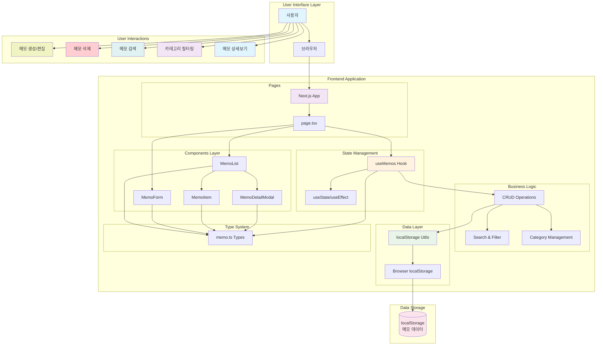

# 메모 앱 시스템 아키텍처

## 개요

메모 앱의 전체 시스템 아키텍처를 보여주는 다이어그램입니다. Next.js 기반의 React 애플리케이션으로, 클라이언트 사이드에서 localStorage를 사용하여 데이터를 관리합니다.

## 시스템 아키텍처 다이어그램

## 아키텍처 구성 요소

### 1. User Interface Layer
- **사용자**: 메모 앱을 사용하는 최종 사용자
- **브라우저**: 웹 애플리케이션을 실행하는 환경

### 2. Frontend Application

#### Pages Layer
- **page.tsx**: 메인 페이지 컴포넌트, 전체 앱의 진입점

#### Components Layer
- **MemoList**: 메모 목록을 표시하고 검색/필터 기능 제공
- **MemoItem**: 개별 메모 카드 컴포넌트
- **MemoDetailModal**: 메모 상세보기 모달
- **MemoForm**: 메모 생성/편집 폼

#### State Management
- **useMemos Hook**: 메모 관련 상태와 비즈니스 로직을 관리하는 커스텀 훅
- **useState/useEffect**: React의 기본 상태 관리 훅들

#### Business Logic
- **CRUD Operations**: 메모 생성, 읽기, 수정, 삭제 기능
- **Search & Filter**: 메모 검색 및 필터링 로직
- **Category Management**: 카테고리별 메모 관리

#### Data Layer
- **localStorage Utils**: localStorage와의 상호작용을 담당하는 유틸리티
- **Browser localStorage**: 브라우저의 로컬 스토리지 API

#### Type System
- **memo.ts Types**: TypeScript 타입 정의 (Memo, MemoFormData, MemoCategory 등)

### 3. Data Storage
- **localStorage**: 브라우저의 로컬 스토리지에 메모 데이터 영구 저장

### 4. User Interactions
- **메모 생성/편집**: 새로운 메모 작성 및 기존 메모 수정
- **메모 삭제**: 메모 삭제 기능
- **메모 검색**: 제목/내용으로 메모 검색
- **카테고리 필터링**: 카테고리별 메모 필터링
- **메모 상세보기**: 메모 카드 클릭 시 상세 내용 모달 표시

## 데이터 흐름

1. **사용자 액션** → **컴포넌트** → **useMemos Hook** → **localStorage Utils** → **localStorage**
2. **localStorage** → **localStorage Utils** → **useMemos Hook** → **컴포넌트** → **UI 업데이트**

## 주요 특징

- **클라이언트 사이드 앱**: 모든 데이터 처리가 브라우저에서 이루어짐
- **타입 안전성**: TypeScript를 사용한 타입 시스템
- **반응형 UI**: React 상태 관리로 실시간 UI 업데이트
- **영구 저장**: localStorage를 통한 데이터 영속성
- **모듈화**: 컴포넌트와 로직의 분리로 유지보수성 향상