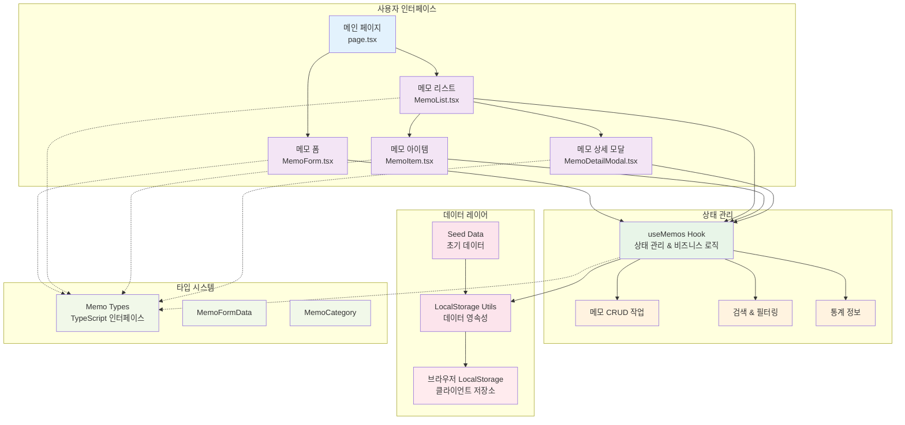

# 메모 앱 시스템 아키텍처

## 개요

이 다이어그램은 메모 앱의 전체 시스템 아키텍처를 보여줍니다. Next.js 기반의 클라이언트 사이드 애플리케이션으로, 컴포넌트 기반 아키텍처와 커스텀 훅을 통한 상태 관리, 그리고 브라우저 LocalStorage를 활용한 데이터 영속성을 특징으로 합니다.

## 다이어그램

## 아키텍처 구성 요소

### 1. 사용자 인터페이스 레이어 (파란색)
- **메인 페이지 (page.tsx)**: 애플리케이션의 진입점이자 레이아웃 관리
- **메모 폼 (MemoForm.tsx)**: 새 메모 생성 및 기존 메모 편집
- **메모 리스트 (MemoList.tsx)**: 메모 목록 표시 및 검색/필터링 UI
- **메모 아이템 (MemoItem.tsx)**: 개별 메모 카드 컴포넌트
- **메모 상세 모달 (MemoDetailModal.tsx)**: 메모 상세 보기 및 액션 버튼

### 2. 상태 관리 레이어 (녹색)
- **useMemos Hook**: 중앙집중식 상태 관리 및 비즈니스 로직
  - **메모 CRUD 작업**: 생성, 읽기, 수정, 삭제 기능
  - **검색 & 필터링**: 실시간 검색 및 카테고리별 필터링
  - **통계 정보**: 메모 개수 및 카테고리별 통계

### 3. 데이터 레이어 (분홍색)
- **LocalStorage Utils**: 브라우저 저장소와의 인터페이스
- **Seed Data**: 초기 샘플 데이터 제공
- **브라우저 LocalStorage**: 실제 데이터 저장소

### 4. 타입 시스템 (연두색)
- **Memo Types**: 메모 객체의 TypeScript 인터페이스
- **MemoFormData**: 폼 데이터 타입 정의
- **MemoCategory**: 카테고리 열거형 타입

## 데이터 플로우

### 1. 사용자 액션 플로우
1. 사용자가 UI 컴포넌트와 상호작용
2. 컴포넌트가 `useMemos` 훅의 함수 호출
3. 훅이 비즈니스 로직 처리 및 상태 업데이트
4. 필요시 LocalStorage Utils를 통해 데이터 영속화
5. 상태 변경으로 인한 UI 리렌더링

### 2. 데이터 읽기 플로우
1. 앱 초기화 시 `useMemos` 훅이 데이터 로드
2. LocalStorage Utils가 브라우저 저장소에서 데이터 조회
3. 데이터가 없으면 Seed Data로 초기 데이터 생성
4. 상태에 데이터 설정 후 UI 업데이트

## 특징

### 장점
- **모듈화**: 각 컴포넌트가 명확한 책임을 가짐
- **재사용성**: 훅을 통한 로직 분리로 재사용 가능
- **타입 안전성**: TypeScript를 통한 강력한 타입 체킹
- **클라이언트 사이드**: 서버 없이 동작하는 독립적인 앱

### 고려사항
- **데이터 동기화**: 여러 탭에서 동시 사용 시 데이터 동기화 필요
- **데이터 백업**: LocalStorage 의존으로 인한 데이터 손실 위험
- **확장성**: 대용량 데이터 처리 시 성능 고려 필요

## 참고사항

이 아키텍처는 소규모 개인용 메모 앱에 최적화되어 있으며, 향후 서버 사이드 데이터베이스 연동이나 실시간 동기화 기능 추가 시 데이터 레이어의 확장이 필요할 수 있습니다.