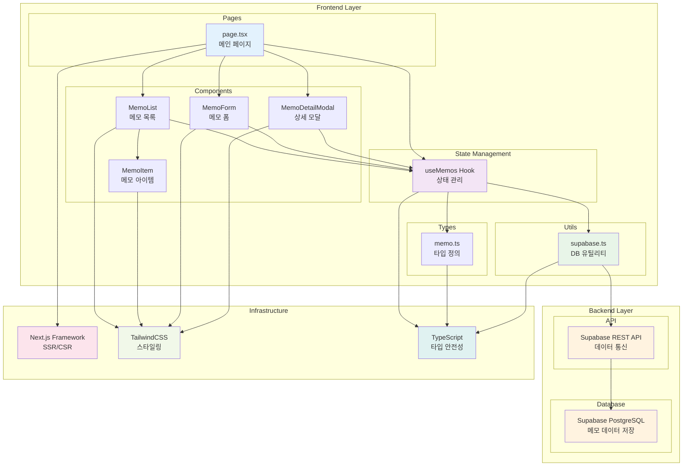

# 메모 앱 시스템 아키텍처

## 개요

메모 앱은 Next.js 기반의 풀스택 웹 애플리케이션으로, Supabase를 백엔드 데이터베이스로 사용하여 메모의 CRUD 기능을 제공합니다. React 컴포넌트 기반 아키텍처와 커스텀 훅을 통한 상태 관리를 특징으로 합니다.

## 시스템 아키텍처 다이어그램

## 아키텍처 구성 요소

### Frontend Layer

#### Pages
- **page.tsx**: 메인 페이지로서 전체 애플리케이션의 진입점 역할
  - 메모 CRUD 기능의 오케스트레이션
  - 모달 상태 관리
  - 사용자 인터랙션 처리

#### Components
- **MemoList**: 메모 목록 표시 및 필터링 기능
- **MemoItem**: 개별 메모 아이템 렌더링
- **MemoForm**: 메모 생성/수정 폼 (모달 형태)
- **MemoDetailModal**: 메모 상세 보기 모달

#### State Management
- **useMemos Hook**: 메모 관련 모든 상태와 비즈니스 로직 관리
  - 메모 CRUD 작업
  - 검색 및 필터링
  - 통계 정보 계산

#### Types & Utils
- **memo.ts**: TypeScript 타입 정의
- **supabase.ts**: 데이터베이스 연결 및 헬퍼 함수

### Backend Layer

#### Database
- **Supabase PostgreSQL**: 메모 데이터 영구 저장
  - 실시간 구독 기능 지원
  - RLS(Row Level Security) 보안

#### API
- **Supabase REST API**: 자동 생성된 RESTful API
  - 타입 안전한 쿼리 지원
  - 실시간 업데이트

### Infrastructure

#### Framework & Tools
- **Next.js**: React 기반 풀스택 프레임워크
- **TailwindCSS**: 유틸리티 우선 CSS 프레임워크
- **TypeScript**: 정적 타입 검사

## 데이터 플로우

1. **사용자 액션**: 사용자가 메모 생성/수정/삭제 등의 액션 수행
2. **상태 관리**: useMemos 훅에서 액션을 받아 처리
3. **데이터베이스 통신**: supabase.ts 유틸리티를 통해 Supabase API 호출
4. **데이터 동기화**: 성공적인 API 응답 후 로컬 상태 업데이트
5. **UI 반영**: React의 상태 변화에 따른 컴포넌트 리렌더링

## 주요 특징

- **타입 안전성**: TypeScript를 통한 컴파일 타임 에러 방지
- **반응형 디자인**: TailwindCSS를 활용한 모바일 친화적 UI
- **실시간 데이터**: Supabase의 실시간 구독 기능 활용 가능
- **모듈화**: 컴포넌트와 훅의 분리를 통한 재사용성 향상
- **상태 중앙화**: useMemos 훅을 통한 메모 관련 상태 통합 관리

## 확장 가능성

- **인증 시스템**: Supabase Auth를 통한 사용자 인증 추가
- **실시간 협업**: 실시간 구독을 통한 다중 사용자 지원
- **파일 업로드**: Supabase Storage를 활용한 첨부파일 기능
- **검색 최적화**: 전문 검색(Full-text Search) 기능 추가
