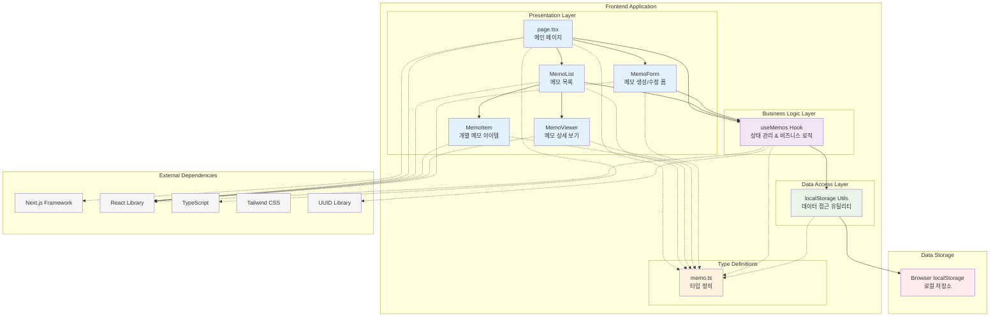

# 메모 앱 시스템 아키텍처

## 개요

이 다이어그램은 Next.js 기반 메모 앱의 전체 시스템 아키텍처를 보여줍니다. 클라이언트 사이드 애플리케이션으로, 브라우저의 localStorage를 데이터 저장소로 사용하는 구조입니다.

## 시스템 아키텍처 다이어그램

## 아키텍처 레이어 설명

### 1. Presentation Layer (프레젠테이션 레이어)
- **page.tsx**: 애플리케이션의 메인 페이지로, 전체 레이아웃과 상태를 관리합니다.
- **MemoList**: 메모 목록을 표시하고 검색/필터링 기능을 제공합니다.
- **MemoItem**: 개별 메모를 카드 형태로 렌더링합니다.
- **MemoViewer**: 선택된 메모의 상세 내용을 모달로 표시합니다.
- **MemoForm**: 메모 생성 및 수정을 위한 폼 컴포넌트입니다.

### 2. Business Logic Layer (비즈니스 로직 레이어)
- **useMemos Hook**: 메모 관련 모든 비즈니스 로직을 담당합니다.
  - 메모 CRUD 연산 (생성, 읽기, 업데이트, 삭제)
  - 검색 및 필터링 기능
  - 통계 정보 계산
  - 상태 관리 (로딩, 검색어, 선택된 카테고리)

### 3. Data Access Layer (데이터 접근 레이어)
- **localStorage Utils**: 브라우저 localStorage와의 모든 상호작용을 추상화합니다.
  - 메모 저장/로드
  - 검색 및 필터링 헬퍼 함수
  - 에러 처리

### 4. Type Definitions (타입 정의)
- **memo.ts**: TypeScript 타입 정의를 포함합니다.
  - Memo 인터페이스
  - MemoFormData 인터페이스
  - 카테고리 타입 및 상수

### 5. Data Storage (데이터 저장소)
- **Browser localStorage**: 클라이언트 사이드 데이터 저장소로 사용됩니다.

## 데이터 플로우

1. **사용자 인터랙션**: 사용자가 UI 컴포넌트를 통해 액션을 수행
2. **상태 관리**: useMemos 훅이 액션을 처리하고 상태를 업데이트
3. **데이터 영속화**: localStorage Utils를 통해 브라우저 저장소에 데이터 저장
4. **UI 업데이트**: 상태 변경에 따라 React 컴포넌트 리렌더링

## 주요 특징

- **클라이언트 사이드 아키텍처**: 서버 없이 브라우저에서 완전히 동작
- **레이어드 아키텍처**: 관심사의 분리를 통한 유지보수성 향상
- **커스텀 훅 기반 상태 관리**: Redux 없이 React 훅을 활용한 상태 관리
- **타입 안전성**: TypeScript를 통한 컴파일 타임 타입 체크
- **반응형 UI**: Tailwind CSS를 활용한 반응형 디자인

## 확장 가능성

현재 아키텍처는 다음과 같은 확장이 가능합니다:
- 백엔드 API 서버 연동 (localStorage 대신)
- 상태 관리 라이브러리 도입 (Redux, Zustand 등)
- 실시간 동기화 기능
- 오프라인 지원 강화
- PWA (Progressive Web App) 변환